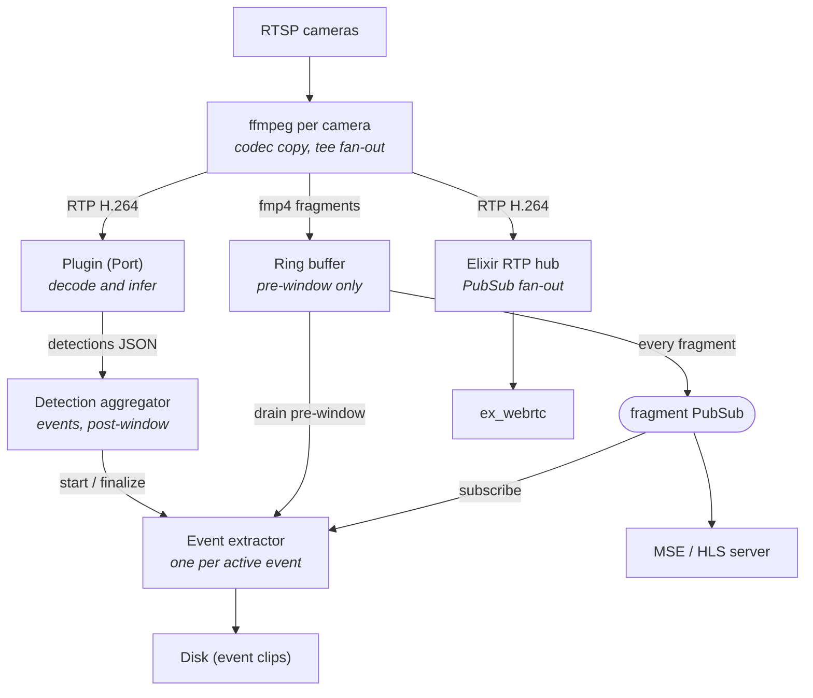

# Brainstorm: Cairn — Elixir NVR with event-based recording

**Status**: COMPLETE (session 2: gap-closing interview + HA-integration research)
**Date**: 2026-07-22
**Coverage**: What ████ | Why ████ | Where ████ | How ████ | Edge ████ | Scope ████
**Score**: 12/12

> **Handoff note**: This document was produced from an extended design discussion
> in a prior project. All major architectural decisions have been made and are
> recorded below with rationale. Treat these as settled unless a decision
> conflicts with something discovered in implementation. Two companion documents
> exist: `architecture.md` (full component detail) and `frigate-comparison.md`
> (analysis of Frigate's storage/memory model and which of its lessons we adopt).

## Summary

Cairn is an Elixir/Phoenix-based NVR (Network Video Recorder) targeting
resource-constrained ARM hardware (QCS6490-class SoCs, 8 GB RAM) that supports
multiple RTSP IP cameras, real-time object-detection inference via a pluggable
external process, low-latency live preview in the browser (WebRTC, MSE, HLS),
and **event-based recording only** — clips are written to disk only around
detections, with a pre/post window. The design's priorities in order:
(1) predictable resource use, (2) a narrow plugin contract so inference
plugin authors targeting different accelerators only implement decode+infer,
(3) operational robustness / self-healing via OTP supervision.

## Project identity

- **Name**: Cairn (each recorded event is a stone marking the trail).
  Availability checked 2026-07-22: no NVR/camera/surveillance product named
  Cairn; USPTO "CAIRN" wordmark exists only in children's clothing (class 25,
  non-conflicting); `cairn-nvr` free on PyPI/npm/GitHub orgs; bare `cairn`
  taken on npm (dormant RN styling lib), crates.io, PyPI (unrelated tools);
  hex.pm believed free (verify with `mix hex.info cairn` before publishing).
  Known noise: "Cairns, Australia" CCTV installers pollute generic searches;
  a coding-agent startup `cairn-dev/cairn` exists in a distant domain.
- **Positioning**: complement to Home Assistant (Nabu Casa ecosystem);
  event-clips product, *not* a continuous-recording DVR (that is an explicit
  future extension, see Scope).

## Coverage Details

### What (2/2)

An OTP application that per camera:

1. Supervises one **ffmpeg** OS process (Port) that ingests RTSP and fans out
   three codec-copy outputs: (a) fragmented mp4 (2-second fragments,
   `frag_keyframe+empty_moov+default_base_moof`) on stdout to BEAM,
   (b) H.264 RTP on UDP to the inference plugin, (c) H.264 RTP on UDP to an
   Elixir RTP hub for WebRTC.
2. Holds a **per-camera in-BEAM ring buffer** (GenServer + `:queue`) of fmp4
   fragments covering only `pre_window_seconds` (default 10s). Every fragment
   is broadcast on a per-camera `Phoenix.PubSub` topic. Exposes an atomic
   `drain_and_subscribe` call (drain pre-window + subscribe in one GenServer
   call, eliminating the boundary race).
3. Supervises one **inference plugin** OS process (Port). Contract: input =
   H.264 RTP on an assigned UDP port + config via argv/env; output =
   newline-delimited JSON detections on stdout
   (`{"camera_id","pts","dets":[{"label","bbox","score"}]}`), logs on stderr.
   The plugin owns decode+inference end-to-end (e.g. GStreamer
   `v4l2h264dec` + vendor NPU element). Raw frames never enter BEAM.
4. A **detection aggregator** GenServer consumes all plugin JSON streams,
   runs IoU tracking, and owns event lifecycle: no-active-event + detection →
   spawn EventExtractor; detection during event → reset post-window timer;
   `post_window_seconds` (default 30) without detection → finalize;
   `max_event_seconds` (default 600) hard cap → finalize and re-open.
   Overlapping detections on one camera **merge** into one event (Frigate
   model: one clip, time-indexed labels as metadata).
5. One **EventExtractor** GenServer per active event (`:temporary` restart,
   under a DynamicSupervisor): opens `events/{camera_id}/{event_id}.mp4`,
   writes init segment, drains pre-window from ring, streams subsequent
   fragments from PubSub directly to disk (memory does NOT grow with event
   duration), on finalize writes metadata to a SQLite event index.
6. **Live preview**: MSE-over-WebSocket as dashboard default (init segment +
   fragments as binary frames, ~2s latency, ~30 lines of vanilla JS client);
   HLS playlist as fallback for non-MSE clients; **WebRTC via ex_webrtc** for
   sub-second viewing (per-camera RTPHub parses RTP and broadcasts on PubSub;
   one PeerConnection process per viewer; RTP hub buffers last GOP and
   replays to new subscribers for instant first frame).
7. **Phoenix LiveView** dashboard UI + event browser backed by the SQLite
   event index.

### Why (2/2)

Existing NVRs (Frigate) are shaped by Python's multiprocessing model: they
need `/dev/shm` for raw-frame IPC, a tmpfs cache + validate-then-promote
pipeline for recordings, and a SQLite catalog of millions of segments; they
record everything to disk continuously (3 disk ops per segment) which is
hostile to eMMC/SSD write endurance on embedded hardware. BEAM's off-heap
reference-counted binaries give zero-copy fan-out natively, and an
event-clips-only product needs no validation stage (fmp4 fragments are valid
by construction) and near-zero steady-state disk writes. Target users are
Home Assistant households wanting local, private, low-power camera events —
not a scrub-through-24h-footage DVR.

### Where (1/2)

New project — no existing codebase. Proposed supervision tree (from
architecture.md):

```
Cairn.Supervisor
├── Cairn.PubSub                    (Phoenix.PubSub)
├── Cairn.EventIndex                (SQLite event metadata; ecto_sqlite3 or exqlite)
├── Cairn.CameraSupervisor          (DynamicSupervisor)
│   └── Cairn.Camera                (per camera, Supervisor, :rest_for_one)
│       ├── Cairn.FFmpegPort        (ffmpeg subprocess + fragment framing on moof/mdat)
│       ├── Cairn.RingBuffer        (pre-window fragment buffer)
│       ├── Cairn.PluginPort        (inference plugin subprocess)
│       └── Cairn.RTPHub            (UDP RTP receiver + GOP replay buffer)
├── Cairn.DetectionAggregator       (JSON from all plugins; ETS-checkpointed state)
├── Cairn.EventSupervisor           (DynamicSupervisor)
│   └── Cairn.EventExtractor        (one per active event, :temporary)
└── CairnWeb.Endpoint               (Phoenix HTTP/WS: LiveView, MSE, HLS, WebRTC signaling)
```

Restart strategy decisions: camera tree is `:rest_for_one` (ring buffer death
also restarts ffmpeg since the new ring is empty anyway); extractor crash
loses only that event (marked `partial` in index on startup scan).

### How (2/2)

Settled technology decisions and their rationale:

- **ffmpeg (one Port per camera) for all RTSP ingest** — not Membrane-native,
  not Live555, not GStreamer-as-ingest. Rationale: 20 years of camera-quirk
  workarounds, argv-driven predictability, codec-copy tee fan-out is <1%
  CPU/camera, crash isolation via Port. Live555 was evaluated and rejected
  (stricter RFC compliance = worse with non-compliant cameras; single
  maintainer). Per-camera `extra_ffmpeg_args` config is the escape hatch for
  weird cameras. Reconnect flags + supervisor restart for resilience; Elixir
  additionally watches fragment arrival rate to detect silent stalls (camera
  TCP alive but 0 fps) and bounces the Port.
- **GStreamer belongs inside the plugin only** — zero-copy DMA-BUF decode →
  NPU matters only for decoded frames, which never cross into BEAM. ffmpeg
  upstream of decode costs nothing (encoded-stream stage has no meaningful
  zero-copy work).
- **In-BEAM ring buffer, not tmpfs, not a Rust sidecar** — tmpfs was the
  original design; moved in-process for per-camera memory budgets, time-based
  eviction, atomic drain+subscribe, no filesystem semantics.
  `slice_ring_buffer` (Rust) was evaluated and rejected (RUSTSEC-2025-0044
  double-free advisories; its contiguous-slice trick is useless for
  variable-size self-contained fragments). BEAM binaries >64 bytes are
  off-heap/refcounted; fan-out is pointer copies. Throughput at 8 cameras ×
  4 Mbps is trivial; even 8×4K with 4 viewers each (~50–60 MB/s) is fine —
  SRTP NIF encryption saturates before BEAM message passing does.
- **ex_webrtc for WebRTC** (Software Mansion; Pion-inspired; SRTP in Rust
  NIFs, AES hw-accelerated on aarch64). Sixteen simultaneous viewers ≪ one
  A78 core. Requirements it imposes on streams: H.264 without B-frames,
  SPS/PPS in-band, keyframe on join (solved by GOP replay buffer).
- **MSE-over-WebSocket as the default live path** (the go2rtc lesson) —
  fragments are already fmp4; no playlist machinery; HLS kept only as
  fallback. `membrane_http_adaptive_stream_plugin` evaluated and skipped
  (designed for Membrane-element pipelines; a playlist renderer over ring
  state is ~100 lines).
- **Non-H.264 cameras**: detect codec at camera-add (SDP from DESCRIBE; a
  thin `membrane_rtsp` DESCRIBE-only probe is acceptable here), warn user to
  switch the camera to H.264, offer explicit opt-in transcode via
  `h264_v4l2m2m` (hw). **No silent libx264 fallback** — refuse with a clear
  error if hw encode is unavailable. When transcoding: `-g = 2×fps` so
  fragments start on IDR, `-bf 0`.
- **fmp4 everywhere**: `-frag_duration 2000000`, fragments framed on
  moof+mdat in the Port handler; event files are single mp4s per event
  (not per-fragment files), crash-resilient up to last complete fragment;
  finalization should yield faststart-equivalent playback (Frigate lesson).
- **SQLite for the event index** (thousands of rows, not millions). Index
  must be rebuildable from disk: filenames encode
  `{event_id}_{camera}_{timestamp}.mp4` and mp4 metadata carries camera ID +
  detection summary; startup task scans for unfinalized/orphaned files.
- **Frigate lessons adopted**: emergency disk cleanup (below a free-space
  threshold, delete oldest events regardless of retention and surface in
  UI); heavy instrumentation of the extractor (write durations, fragment
  counts, finalization timing); JPG snapshot per event from a keyframe for
  UI thumbnails; per-camera retention policy schema with per-label override.
- **Resource budget** (8 × 1080p @ 4 Mbps): ffmpeg <8% CPU total; plugin
  30–60% (dominates); BEAM <5% idle / 10–15% with viewers; ring RAM ~40 MB
  (formula: `cameras × bitrate × pre_window / 8`); disk writes 0–4 MB/s only
  during events. Scaling walls: inference budget first, then disk capacity.

### Edge Cases (1/2)

Identified and designed for:

- Camera drops / silent stalls → ffmpeg reconnect flags + fragment-rate
  watchdog + supervisor restart.
- Event longer than memory → extractor streams to disk from event start;
  ring holds only pre-window; `max_event_seconds` cap splits runaway events
  (IR-lit waving branches).
- Crash mid-event → fmp4 is readable up to last fragment; startup scan marks
  `partial`.
- Drain/subscribe boundary race → atomic `drain_and_subscribe` in the ring's
  GenServer.
- Disk full → emergency cleanup with UI surfacing.
- Concurrent overlapping detections → merge into one event.
- Plugin crash → Port supervision restarts it; aggregator state checkpointed
  to ETS.

Remaining open (minor, plan-level): behavior when SQLite index and disk
disagree beyond simple rebuild (proposed default: disk is truth — startup
reconciliation drops index rows without files, adopts orphaned files);
SQLite schema migrations across upgrades (standard Ecto migrations at boot).

## Session 2 decisions (2026-07-22, gap-closing interview)

- **Deployment**: undecided by design — v1 is a deployment-agnostic standard
  OTP release with **all mutable state under one data directory** (SQLite
  index, event clips, snapshots), so it runs in a container, directly on the
  vendor BSP, or can later be wrapped in Nerves without rework. Upgrade =
  replace release, restart; Ecto migrations run at boot.
- **Config model**: a **YAML config file is the source of truth** for cameras
  (RTSP URLs, credentials, pre/post windows, min_score, extra_ffmpeg_args,
  transcode opt-in) and global settings, Frigate-style. The UI is read-only
  for config. Changes apply on **restart or explicit reload** (button/CLI) —
  no file watching; camera-add UX = edit YAML, reload, UI shows probe
  results/warnings (e.g. non-H.264 codec) per camera.
- **Auth**: **none in v1** — LAN-trusted; documentation prescribes a reverse
  proxy / HA ingress for anything else. Multi-user/roles deferred (this
  closes the "auth model / multi-user" open items as conscious deferrals).
- **Dev inference story**: **both** a mock plugin (replays scripted detection
  JSON; deterministic, used in ExUnit/CI to exercise the full Port lifecycle,
  aggregator, and extractor) and a **CPU reference plugin** (decode + small
  ONNX model) so the complete pipeline runs on x86 dev machines and doubles
  as documentation-by-example for plugin authors.
- **HA integration**: researched (Frigate's MQTT+custom-integration stack,
  MQTT-discovery-only, custom HACS integration, ONVIF, webhooks — findings in
  `.claude/plans/cairn-nvr/research/frigate-ha-integration.md` and
  `ha-integration-options.md`) and **deferred entirely from v1**. V1 is
  standalone. Design obligation retained: the event lifecycle
  (new/update/end) and event JSON schema must be publisher-friendly so MQTT
  and/or webhooks bolt on later without reworking the aggregator — treat
  event publishing as a future subscriber, like continuous recording.
  Research notes for that future work: broker dependency is Frigate's #1
  reported pain point; a custom HACS integration (zeroconf discovery, camera
  entities, media_source clip browsing over a stable HTTP API) is the
  out-of-box-experience ceiling; publish event IDs immediately with async
  media fetch; dedupe notifications by event ID.

### Scope (2/2)

**In scope (v1)**: RTSP H.264 cameras; single-host deployment; event-based
recording with pre/post windows; MSE live view + HLS fallback + WebRTC;
LiveView dashboard + event browser; one plugin implementation for QCS6490
(GStreamer + Hexagon NPU); opt-in hw transcode for non-H.264.

**Explicitly out of v1 (settled deferrals)**:

- **Continuous recording** — architecture supports it as a future fourth
  fragment subscriber (hour-rolled mp4s + per-fragment stats + Frigate-style
  retention queries); ring buffer and extractor are unchanged by it. Feature,
  not refactor.
- **Camera-side AI as a detection source** — a `DetectionSource` behaviour
  (LocalPlugin | ONVIFMetadata | MQTT) was designed and consciously deferred;
  the aggregator's input contract is the extension point. Current
  architecture uses the local plugin only.
- **HEVC-over-WebRTC negotiation** (browser support too fragmented).
- **Two-stream record-original/transcode-preview** for non-H.264 cameras.
- **Vendor-specific camera AI adapters** (Reolink API etc.) — MQTT-via-HA
  would cover these if the DetectionSource work is ever picked up.
- Software (libx264) transcode fallback — deliberately refused, not deferred.
- **Home Assistant integration** (MQTT publishing, custom HACS integration,
  webhooks) — deferred after research (session 2); event schema/lifecycle
  must stay publisher-friendly as the extension point.
- **Web UI auth / multi-user / roles** — v1 is LAN-trusted; reverse proxy or
  HA ingress documented for anything more (session 2 decision).

## Codebase Context

Greenfield. Companion documents to place in the repo root or `docs/`:
`architecture.md` (authoritative component detail, includes Mermaid diagram,
RingBuffer/EventExtractor code sketches, ffmpeg invocation), and
`frigate-comparison.md` (why this design differs from Frigate and which of
its production lessons transfer). The Mermaid overview:



Configuration parameters already defined: `pre_window_seconds` (10),
`post_window_seconds` (30), `max_event_seconds` (600), `min_score` per label,
per-camera `extra_ffmpeg_args`, per-camera transcode opt-in.

## Research Findings

Prior-session research already performed (summarized; no need to repeat):

### Approach: ex_webrtc for the WebRTC path (ADOPTED)
- **Thesis**: W3C-compliant, actively maintained (Software Mansion), Rust-NIF
  SRTP, proven in Broadcaster/Fishjam; H.264 passthrough works.
- **Antithesis**: per-peer GenServer orchestration cost — fine for dozens of
  viewers, not thousands (acceptable: NVR audience).

### Approach: GStreamer webrtcbin for live preview (REJECTED for v1)
- **Thesis**: battle-tested, stays in GStreamer hot path.
- **Antithesis**: would live in the plugin, violating the narrow plugin
  contract — the deciding factor.

### Approach: Rust ring-buffer sidecar / slice_ring_buffer (REJECTED)
- **Thesis**: explicit memory control.
- **Antithesis**: RUSTSEC-2025-0044; wrong abstraction for variable-size
  fragments; BEAM binaries already give zero-copy fan-out; adds an IPC
  boundary for no measured benefit.

### Approach: tmpfs fragment directory + inotify (SUPERSEDED)
- Original design; replaced by in-BEAM ring for per-camera budgets, atomic
  drain+subscribe, and time-based eviction.

### Session 2 research cycle: four open technical questions (RESOLVED)

Full reports in `.claude/plans/cairn-nvr/research/` (`sqlite-library.md`,
`rtsp-probe.md`, `mse-transport.md`, `udp-port-allocation.md`). Decisions:

- **Event index: `ecto_sqlite3`** (over raw `exqlite`). Both are healthy
  (same elixir-sqlite org, active mid-2026 releases, precompiled aarch64
  NIFs — no on-device toolchain). Ecto buys composable queries for the
  LiveView event browser and standard migrations (needed for the upgrade
  story). Config notes: WAL is the adapter default; raise `busy_timeout`
  above the 2000 ms default; tune `pool_size` down (~1–2) — SQLite
  serializes writers in WAL mode regardless.
- **Codec probe: `ffprobe` shell-out primary; `membrane_rtsp` deferred.**
  ffprobe probes with the exact stack that performs ingest (probe success
  predicts ingest success; reliably reports resolution, which SDP often
  omits) and adds zero deps. Revisit `membrane_rtsp` (confirmed standalone,
  proven Digest auth, typed errors) only if error-UX/finer control demands
  it. Manage the subprocess with a hard timeout; parse `-show_streams` JSON.
- **MSE transport: Phoenix Channel** (binary payloads via `{:binary, data}`)
  over raw WebSock. Rationale: free reconnect/multiplexing machinery and a
  future auth integration point outweigh per-subscriber encode overhead at
  NVR viewer counts. Design obligation carried into planning: **slow-consumer
  policy is manual either way** — monitor `message_queue_len`, drop to next
  keyframe/fragment or disconnect; must be explicit in the plan.
- **UDP ports: configured port ranges** (the Janus/Asterisk/FreeSWITCH
  pattern). A base range in the YAML config; deterministic per-camera slots
  (e.g. base + 2×index for plugin and RTP hub). UDP has no TIME_WAIT, so
  supervisor restarts rebind cleanly. Plugin contract keeps its assigned
  port via argv — no handshake step. Validation at config load rejects
  overlapping/exhausted ranges.