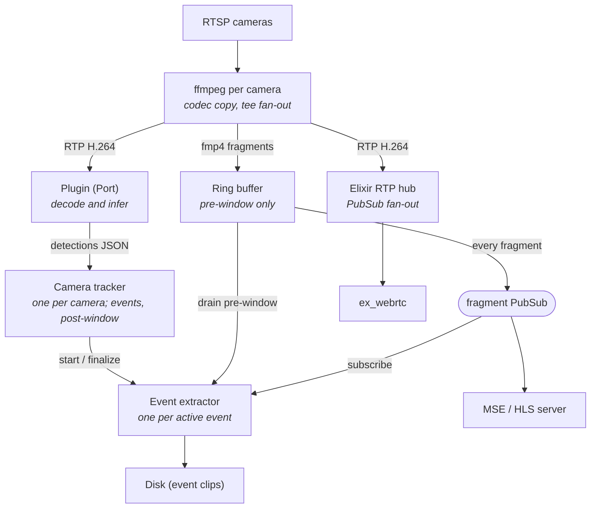

# NVR Architecture

This document describes the architecture of an Elixir-based NVR (Network Video Recorder) designed to run on resource-constrained hardware (e.g. QCS6490) while supporting multiple IP cameras, real-time inference, low-latency live preview, and event-based recording.

The design optimizes for three goals, in this order:

1. **Predictable resource use.** No unbounded memory growth, no surprise CPU spikes from things the user didn't ask for.
2. **Plugin simplicity.** The contract for an inference plugin should be narrow enough that authors targeting different accelerators (Hexagon NPU, Hailo, Coral, RKNN) only have to implement the parts unique to their hardware.
3. **Operational robustness.** Cameras drop, networks blip, processes crash. The system should self-heal without operator intervention.

## High-level overview



The architecture has three independent data planes that meet only at well-defined boundaries:

- **Encoded video plane.** RTSP comes in, gets demuxed once by ffmpeg, and fans out three ways. ffmpeg owns this entire plane and BEAM never sees raw network bytes.
- **Inference plane.** The plugin owns decode and inference end-to-end. Its only inputs are H.264 RTP packets; its only outputs are detection events as JSON. It runs as one process per camera, or — for hardware a single process must hold exclusively — one process per named plugin group serving several cameras.
- **Event plane.** Detection aggregation, event lifecycle, and clip extraction happen in BEAM. This plane consumes from the encoded plane (via PubSub) and produces files on disk.

The separation is deliberate: each plane has different latency, throughput, and failure characteristics, and centralizing them in a single process would force the worst case of all three.

## Why ffmpeg for ingest

The encoded plane is owned by `ffmpeg`, one process per camera, supervised by Elixir as a `Port`. ffmpeg handles RTSP, transport negotiation (UDP vs TCP-interleaved vs HTTP-tunneled), authentication (Basic, Digest MD5/SHA-256, vendor-specific quirks), reconnect/backoff, codec demuxing, and the three downstream outputs.

The case for ffmpeg over alternatives (Membrane native, Live555, GStreamer):

- **Camera compatibility.** ffmpeg's RTSP demuxer has accumulated two decades of vendor-specific workarounds. Every IP camera vendor tests against ffmpeg explicitly. The long tail of "this Reolink model doesn't quite follow the RFC" is handled.
- **Operational maturity.** Argv-driven, fully predictable, every weird camera has a Stack Overflow answer. Reconnect, timeout, and transport flags are well-documented.
- **Codec-copy fan-out is essentially free.** ffmpeg's `tee` muxer demuxes the RTSP stream once and writes to N output sinks without copying the payload through userspace buffers. CPU usage is sub-1% per camera at 1080p.
- **No NIF risk.** Crashes are isolated to a Port process and recovered by the supervisor.

Per-camera invocation pattern (H.264 source, no transcoding):

```
ffmpeg -rtsp_transport tcp \
       -reconnect 1 -reconnect_streamed 1 -reconnect_delay_max 5 \
       -stimeout 10000000 \
       -i rtsp://camera/stream \
       -map 0:v -c:v copy \
         -f mp4 -movflags frag_keyframe+empty_moov+default_base_moof \
         -frag_duration 2000000 pipe:1 \
       -map 0:v -c:v copy \
         -f rtp -payload_type 96 rtp://127.0.0.1:5001 \
       -map 0:v -c:v copy \
         -f rtp -payload_type 96 rtp://127.0.0.1:5002
```

Three outputs, all H.264 codec-copy:

1. **Fragmented mp4 to stdout** (`pipe:1`), framed on `moof+mdat` boundaries. The Elixir Port handler reads stdout, parses fragment boundaries, and forwards each complete fragment to the camera's ring buffer.
2. **RTP to UDP 5001**, consumed by the inference plugin.
3. **RTP to UDP 5002**, consumed by the Elixir RTP hub for WebRTC fan-out.

### Handling non-H.264 cameras

When the source codec isn't H.264 (HEVC, MJPEG, etc.), the recommended path is to surface a UI warning at camera-add time and prompt the user to change the camera's encoder setting. Re-encoding at runtime burns SoC budget that should go to inference.

If the user opts in (or for cameras with no H.264 option), the ffmpeg invocation switches to hardware-accelerated transcoding via `h264_v4l2m2m` on the QCS6490. Software fallback (`libx264`) is explicitly *not* enabled — if hardware encode is unavailable, transcoding is refused with a clear error rather than silently saturating the CPU.

## The plugin contract

The plugin is a `Port`-supervised external process. It runs whatever decode and inference pipeline its hardware target needs (typically a GStreamer pipeline using `v4l2h264dec` and a vendor inference element on the QCS6490).

Inputs:

- H.264 RTP packets on a fixed UDP port per camera served, assigned by Elixir at plugin start.
- Camera ID and configuration provided as CLI arguments or environment variables.

Outputs:

- Newline-delimited JSON detection events on stdout. Each line is a complete event:
  ```json
  {"camera_id":"front","pts":3672859023,"dets":[{"label":"person","bbox":[0.42,0.31,0.18,0.36],"score":0.92}]}
  ```
- Log messages on stderr.

The plugin does *not* handle RTSP, fragment writing, muxing, ring buffering, event lifecycle, or WebRTC. A new plugin author targeting a different accelerator only needs to implement the decode-to-inference pipeline; everything else is provided by the Elixir host.

### One process per camera, or one per group

Two process shapes share this contract. The default is one plugin process per camera. The alternative is a named **plugin group**: a command declared once under a top-level `plugins:` map, joined by every camera that says `plugin: <name>`, and launched as a single process with a `--cameras-json` array of its members instead of the per-camera flags. Group output is the same ndjson, except `camera_id` is required — it is the only thing routing a line, since one process now speaks for several cameras.

The motivating case is an accelerator that only one process can hold at a time (a Coral Edge TPU), which a process per camera can never share. The mode is a config-shape decision, not a count: a group with one member is still launched as a group.

A group's lifecycle is deliberately decoupled from its members. It is restarted only when its config changes — the command, the membership, a member's score floors, or a member's UDP port — and never by anything a camera does at runtime, so a stopped member simply stops sending packets. Plugins serving a group must therefore treat a silent stream as normal and re-open it forever rather than exit: the group is one failure domain, and exiting over one stream stops detection for every member. `docs/plugin-contract.md` is the authoritative spec.

## The ring buffer

The ring buffer is a per-camera GenServer that holds `pre_window_seconds` worth of fmp4 fragments in memory. Its responsibilities:

- Receive fragments from the ffmpeg Port handler.
- Evict fragments older than `pre_window_seconds`.
- Broadcast each new fragment to a per-camera Phoenix.PubSub topic.
- Serve `drain_pre_window/1` requests atomically (drain + subscribe in one call to avoid races).

```elixir
defmodule NVR.RingBuffer do
  use GenServer

  def init(camera_id) do
    {:ok, %{
      camera_id: camera_id,
      fragments: :queue.new(),
      pre_window_pts: 10 * 90_000  # 10 seconds at 90kHz PTS clock
    }}
  end

  def handle_cast({:fragment, frag}, state) do
    state = state |> append(frag) |> evict_old()
    Phoenix.PubSub.broadcast(NVR.PubSub, topic(state.camera_id), {:fragment, frag})
    {:noreply, state}
  end

  def handle_call({:drain_and_subscribe, since_pts, subscriber_pid}, _from, state) do
    fragments = :queue.to_list(state.fragments)
                |> Enum.drop_while(fn f -> f.pts < since_pts end)
    Phoenix.PubSub.subscribe(NVR.PubSub, topic(state.camera_id))
    Process.link(subscriber_pid)
    {:reply, fragments, state}
  end
end
```

### Memory characteristics

Memory usage is bounded by `pre_window × bitrate × camera_count`, independent of event duration. At 8 cameras, 4K, 12 Mbps, 10-second pre-window: ~120 MB total, fixed.

Fragments are stored as `bytes` (BEAM binaries). Binaries over 64 bytes live off-heap and are reference-counted; sending a fragment to multiple subscribers is a pointer copy, not a memcpy. Live MSE viewers, event extractors, and the WebRTC RTP hub can all hold references to the same underlying memory simultaneously.

### Why not tmpfs

An earlier design wrote fragments to tmpfs and used inotify to notify subscribers. Moving the buffer in-process gains:

- **Per-camera memory budgets.** tmpfs `size=` is per-mount, not per-camera.
- **Time-based eviction.** "Drop fragments older than N seconds" is awkward with files.
- **Atomic snapshots.** Drain-and-subscribe in one call eliminates a class of races.
- **No filesystem semantics.** No inodes, dentries, or stat-storming under load.

The tradeoff is that BEAM is now in the data path. Throughput math: 8 cameras × 4 Mbps × broadcast-to-N-subscribers is well within BEAM's binary-passing capabilities. The hot path for any subscriber is "receive `{:fragment, bin}` message," which is sub-microsecond.

## The camera tracker

Event lifecycle is owned one camera at a time: a `CameraTracker` GenServer per camera, fed only that camera's observations — by its own plugin Port, or by the group Port that routes each ndjson line on its `camera_id`. One camera's tracking state, crash, and recovery are therefore that camera's alone.

They live under `Cairn.TrackerSupervisor`, a `:rest_for_one` pair: a `DynamicSupervisor` pool holding one `:transient` tracker per camera, started on demand by that camera's first observation, and behind it a sweep that starts trackers for cameras whose ETS checkpoint outlived them. A crashed tracker is restarted by the pool and restores in `init/1`; a pool restart cascades into the sweep, which does the same for every checkpointed camera at once.

Each tracker holds:

- `active_event` — the currently-active `EventExtractor` PID, or `nil`.
- `last_detected_ms` (per track, inside the `Cairn.Tracker`) — the tracking-clock instant of that track's most recent *detected* box, which is what the stale-predicted rule measures from.
- `objects` — an IoU tracker for assigning detections to persistent object IDs across frames.

State transitions per detection:

```
no active event + detection → start new EventExtractor, send :start
active event + detection    → reset post-window timer
no detection for post_window → send :finalize to EventExtractor, clear active_event
```

A tracker never holds video data — it operates purely on JSON detections, which are small and frequent. Its job is debouncing detection noise into clean event boundaries.

### Configurable thresholds

- `pre_window_seconds` (default 10) — how much lead-up to ask for before detection. The clip retains *up to* that much: the ring may not have filled yet, and the pre-roll is cut back to its first keyframe (see the extractor below).
- `post_window_seconds` (default 30) — how long after the last detection before finalizing.
- `max_event_seconds` (default 600) — hard cap on a single event's duration. Beyond this, the current event is finalized and a new one starts if detection continues.
- `min_score` per label — score threshold for considering a detection valid.

## The event extractor

One `EventExtractor` GenServer is spawned per active event. It is the only component that writes to permanent storage.

Lifecycle:

1. **Init.** Open output file at `events/{camera_id}/{event_id}.mp4`. Write fmp4 init segment.
2. **Pre-window drain.** Call `RingBuffer.drain_and_subscribe(camera_id, started_at_pts - pre_window, self())`. Receive the list of pre-window fragments and append each to the file. The atomic drain+subscribe is what prevents the boundary race between "fragments already in the ring" and "fragments arriving from now on."
3. **Streaming.** Receive `{:fragment, frag}` messages from PubSub. Append each to the file, optionally `fsync` at fragment boundaries.

   Steps 2 and 3 share one rule: **nothing is written until a fragment whose first sample is a keyframe**, and that fragment is the clip's t=0. On a camera whose GOP is longer than its fragment duration, that discards up to one GOP off the front of the pre-roll. The alternative is worse — the finalizing remux (`ffmpeg -c copy`) silently drops leading samples it has no keyframe for and records the hole as an empty edit, leaving every consumer of the file late by the dropped span with nothing to detect it by.
4. **Finalize.** On `:finalize` call from the camera's tracker: unsubscribe, write mp4 trailer (or just close, since fmp4 is independently readable), insert event metadata into the SQLite event index, exit normally.

```elixir
defmodule NVR.EventExtractor do
  use GenServer, restart: :temporary

  def init({camera_id, event_id, started_at_pts}) do
    file = File.open!(event_path(event_id), [:write, :binary, :raw])
    write_init_segment(file, camera_id)

    pre_pts = started_at_pts - @pre_window_pts
    pre = NVR.RingBuffer.drain_and_subscribe(camera_id, pre_pts, self())
    Enum.each(pre, &write_fragment(file, &1))

    {:ok, %{file: file, event_id: event_id, camera_id: camera_id, bytes_written: total_bytes(pre)}}
  end

  def handle_info({:fragment, frag}, state) do
    write_fragment(state.file, frag)
    {:noreply, %{state | bytes_written: state.bytes_written + byte_size(frag.data)}}
  end

  def handle_call(:finalize, _from, state) do
    Phoenix.PubSub.unsubscribe(NVR.PubSub, "camera:#{state.camera_id}:fragments")
    File.close(state.file)
    NVR.EventIndex.insert(%{
      id: state.event_id,
      camera_id: state.camera_id,
      bytes: state.bytes_written,
      path: event_path(state.event_id)
    })
    {:stop, :normal, :ok, state}
  end
end
```

### Crash resilience

Fragmented mp4 is naturally crash-resilient: each `moof+mdat` pair is independently readable. An unfinalized event file is still a valid playable mp4 up to its last complete fragment. On startup, a cleanup task scans for unfinalized files (no entry in the event index) and either repairs the trailer or marks them as `partial` in the index.

## The MSE/HLS server

The browser dashboard's default live-preview path. A `Phoenix.Channel` (or plain `Plug` upgraded to WebSocket) per viewer:

1. On connect: read the camera's init segment (cached in the ring buffer or its supervisor) and send as a binary frame.
2. Subscribe to `camera:{id}:fragments` PubSub topic.
3. For each `{:fragment, frag}` message, send `frag.data` as a binary frame.
4. On disconnect: unsubscribe.

Browser side uses Media Source Extensions to feed the binary frames into a `<video>` element's `SourceBuffer`. ~30 lines of vanilla JS, no library required.

Latency is approximately one fragment duration plus network — typically ~2 seconds. This is the right tradeoff for a security-camera dashboard where the user is monitoring presence, not driving a PTZ.

HLS is provided as a fallback for clients that don't support MSE (very old Safari, embedded browsers in some video panels), implemented as a thin playlist generator over the same ring buffer state.

## The WebRTC hub

For low-latency viewing (sub-second), a separate path uses `ex_webrtc`. The architecture:

- `Camera.RTPHub` — one GenServer per camera, owns the UDP socket on port 5002+. Parses RTP headers (sequence number, timestamp, payload type, marker bit) and broadcasts each packet to a per-camera RTP topic.
- `WebRTC.PeerConnection` — one process per browser viewer, spawned when the LiveView WebRTC preview component connects. Subscribes to the camera's RTP topic, encrypts each packet with SRTP, and sends to the peer.

Per-viewer cost is dominated by SRTP encryption, which uses Rust NIFs (AES-GCM with hardware acceleration on aarch64). Sixteen simultaneous WebRTC viewers across all cameras is well under one A78 core.

### Keyframe-on-join

A new WebRTC viewer needs a keyframe immediately. With 2-second GOP cameras, the worst case is a 2-second wait. To make it instant, the RTP hub buffers the most recent GOP (~few hundred KB) and replays those packets to each new subscriber before live packets begin.

## Process supervision tree

```
NVR.Supervisor
├── NVR.PubSub                     (Phoenix.PubSub)
├── NVR.EventIndex                 (SQLite event metadata)
├── NVR.CameraSupervisor (DynamicSupervisor)
│   ├── NVR.Camera (one per camera, Supervisor)
│   │   ├── NVR.FFmpegPort         (supervises ffmpeg subprocess)
│   │   ├── NVR.RingBuffer         (in-memory fragment buffer)
│   │   ├── NVR.PluginPort         (supervises plugin subprocess; absent for group members)
│   │   └── NVR.RTPHub             (UDP receiver for WebRTC)
│   └── ... (more cameras)
├── NVR.PluginGroupSupervisor      (one plugin Port per named group, serving N cameras)
├── NVR.TrackerSupervisor          (rest_for_one)
│   ├── NVR.TrackerSupervisor.Pool (DynamicSupervisor)
│   │   └── NVR.CameraTracker      (one per camera, transient; that camera's observations)
│   └── checkpoint restore sweep   (Task, transient; re-runs when the pool restarts)
├── NVR.EventSupervisor (DynamicSupervisor)
│   └── NVR.EventExtractor         (one per active event, transient)
└── NVR.Endpoint                   (Phoenix HTTP/WebSocket)
```

Restart strategies:

- A camera supervisor uses `:rest_for_one`: if ffmpeg dies, restart it (state is recoverable from the camera). If the ring buffer dies, restart ffmpeg too (since the new ring won't have the old fragments anyway).
- A plugin group sits outside any one camera's supervisor, because it outlives them individually: it is started and restarted only on config change, and members stopping or starting leave it running. That makes the group one failure domain — a crash costs every member detection until the backoff restart — which is the price of sharing the device.
- Event extractors are `:temporary` — if one crashes, the event is lost (logged as `partial` in the index) but other events continue.
- Camera trackers are `:transient`. Each checkpoints its active event and the tracks live under it to an ETS table owned outside the tracking tree, so a restarted tracker restores in `init/1` instead of waiting for its camera's next observation. `NVR.TrackerSupervisor` is `:rest_for_one` for the case the pool itself restarts: the cascade re-runs the restore sweep, which is the only thing that would otherwise re-adopt checkpoints no surviving tracker owns.

## Resource budget

Approximate budget for 8 cameras at 1080p H.264, 30fps, 4 Mbps:

| Resource | Usage | Notes |
|----------|-------|-------|
| ffmpeg CPU | <8% (1% per camera) | Codec-copy fan-out is nearly free |
| Plugin CPU | 30–60% | Inference workload, dominates |
| BEAM CPU | <5% idle, 10–15% with viewers | Mostly SRTP encryption |
| Ring buffer RAM | ~40 MB | 8 × 4 Mbps × 10s / 8 |
| Disk write rate | 0–4 MB/s | Only during active events |
| Disk capacity | ~3 GB/event-hour | Per camera at 4 Mbps |

The two scaling dimensions worth watching:

- **Inference budget.** Adding cameras hits this first. With a plugin process per camera, the per-camera cost is fixed and the total scales linearly. A plugin group instead shares one process — and one model, and one accelerator — across its members, so the ceiling is that device's throughput rather than the camera count; for a device only one process can hold (Coral Edge TPU), it is the only shape that works at all.
- **Disk capacity.** Long retention windows for event clips dominate. Continuous recording, if added, dominates by an order of magnitude.

Memory and BEAM CPU are not the bottleneck and are not expected to become so.