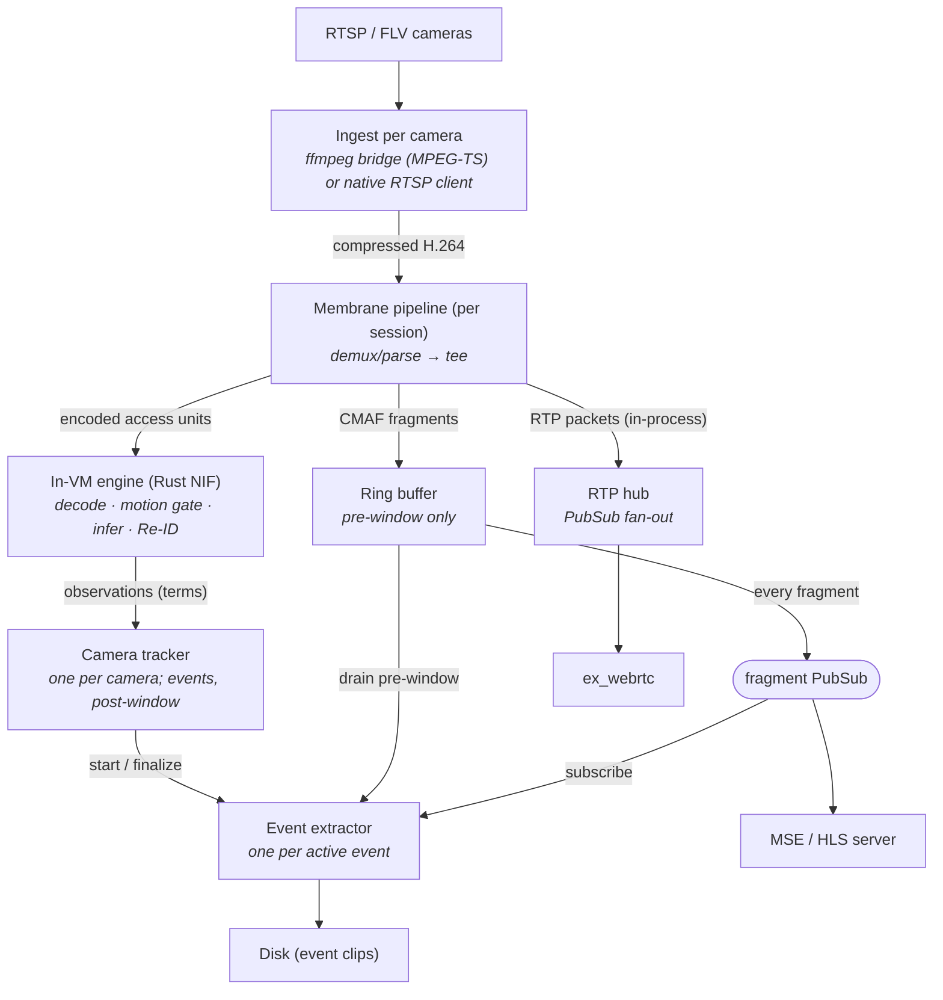

# NVR Architecture

This document describes the architecture of an Elixir-based NVR (Network Video Recorder) designed to run on resource-constrained hardware (e.g. QCS6490, Rockchip SBCs) while supporting multiple IP cameras, real-time inference, low-latency live preview, and event-based recording.

The design optimizes for three goals, in this order:

1. **Predictable resource use.** No unbounded memory growth, no surprise CPU spikes from things the user didn't ask for.
2. **One supervision tree.** Media, detection and event lifecycle all live in the BEAM. There is no process-management inventory — no UDP port allocation, no cross-process epoch fencing, no wire protocol between the host and its own detector. (The external-plugin architecture this replaced is archived in `docs/archive/plugin-contract.md`.)
3. **Operational robustness.** Cameras drop, networks blip, processes crash. The system self-heals without operator intervention, and the failure domain of each piece is explicit.

## High-level overview



Three planes still meet only at well-defined boundaries, but they now share one VM:

- **Encoded video plane.** One ingest session per camera delivers compressed H.264 into the camera's long-lived Membrane pipeline, which fans it out three ways without ever decoding for display: CMAF fragments to the ring, RTP packets to the WebRTC hub, encoded access units to the detect branch. Cairn is codec-copy end to end for everything a human watches.
- **Inference plane.** The detect branch decodes and infers inside the node's own engine — `plugins/cairn-detect`'s stage library linked as the `cairn-native` NIF, running on dirty schedulers. Frames never leave the crate; what crosses the NIF boundary is compressed access units in and observation terms out.
- **Event plane.** Detection aggregation, event lifecycle, and clip extraction consume from the other two via PubSub and produce files on disk.

## Ingest

A camera's connection lifecycle — connect, loss, reconnect with a jittered 1 s → 30 s backoff — belongs to whatever owns the socket, never to a supervisor: a dead camera is a normal long-lived state. Where that owner sits is the only difference between the two ingests:

- **ffmpeg bridge** (default). `Cairn.FFmpegPort` owns one supervised ffmpeg per camera as a dumb demuxer: RTSP (or vendor FLV-over-HTTP) in, **MPEG-TS on stdout** out — a container with pts, which the Fragment timing and the ObservationClock need. It stays *outside* the pipeline so a pipeline crash cannot take the camera's backoff state with it; the bytes reach `Cairn.Pipeline.BridgeSource`, resolved through `Cairn.Registry`. ffmpeg is kept for its two decades of camera-vendor workarounds; it no longer fans out, transcodes for consumers, or touches UDP.
- **native RTSP** (`ingest: rtsp`, per camera). `Membrane.RTSPDualStream.Source` owns the client sessions *inside* the element: the `rtsp` library handles socket/depayload/digest/keepalive and delivers whole access units with pts, and the element reconnects on its own. There is no FFmpegPort for that camera at all. Quirky cameras keep the ffmpeg bridge — the flag is per-camera and reversible.

Either way a session's end is in-band (`StreamClosed`), and the stream epoch is minted from the media itself by `Cairn.Pipeline.EpochTagger` as the next session's first buffer is produced — never by the process that owns the connection.

Non-H.264 cameras: Cairn probes and warns. Opt-in `transcode: true` uses hardware `h264_v4l2m2m` inside the bridge only — there is deliberately no software fallback, and RTSP-native ingest refuses transcode (there is no ffmpeg in that chain).

### The long-lived pipeline

`Cairn.PipelineOwner` starts one `Cairn.Pipeline.Camera` (Membrane) per camera and monitors it — deliberately **not** a supervisor child, so that a crash-looping pipeline backs off instead of burning supervisor intensity. It is rebuilt for exactly two reasons: it died, or the owner's watchdog found a wedge (detect branch stale behind a healthy ring; ring stale while the source reports itself connected — for a bridge camera only after an `FFmpegPort.bounce/1` fails to clear it). A mere outage rebuilds nothing: the source reconnects underneath.

Topology: source (`BridgeSource` or `RTSPDualStream.Source`) → TS demux (bridge only; RTSP carries pts natively and the source declares its own format from each session's SPS) → `EpochTagger` → tee →

1. **Recording branch**: `SessionCut` → CMAF muxer → `RingBufferSink`, shaping each segment into a `Cairn.Fragment` (pts from the segment's own `tfdt`, timescale from the init header, `keyframe?` = first sample is a sync sample). The muxer survives neither a session's pts reset nor an identical-SPS reconnect, so the gate ends its branch's stream on `StreamClosed` — which is also what flushes the muxer's held tail into the ring — and the owner links a fresh branch immediately.
2. **RTP branch**: `SessionCut` → RFC 6184 payloader → in-process `push_packet/2` into `Cairn.RTPHub`. No sockets anywhere; per-session too, which is what gives each session its own ssrc.
3. **Detect branch**: picker (backpressure, keep-newest depth-1, refuses to emit across a dropped-AU hole until the next IDR) → `Inference` (the NIF call site, one call in flight) → `ObservationStamper` (the observation clock, and the per-batch tracking context resolved from config + the runtime overlay) → `Membrane.MOTTracker` (the generic tracker element hosting the core the config names — `Cairn.Tracker` by default) → `TrackSink` (tagged objects, lifecycle events and a checkpoint snapshot → `Cairn.Detect.Dispatch` → the camera's `CameraTracker`, which owns the event lifecycle and nothing else). Absent when the camera names no `plugin:`. Never per-session: the decoder's and inference's native state is the expensive half, and it is exactly what a reconnect must not cost — the epoch rides buffer metadata instead, and `Inference` reopens its stream when it changes.

## Detection: the in-VM engine

`cairn-detect`'s stages (decode/hwdecode, motion gate, inference, Re-ID embedder) are one Rust library with two consumers: the standalone binary (used by the canary, the parity harness, and board benches) and the `cairn-native` Rustler NIF the node loads. They cannot diverge — same crate, same code.

- **One engine, one model per node.** Config load refuses groups whose profiles ask for different models. The engine's model config comes from the hardware profile the camera's `plugins:` group names.
- **Dirty schedulers, errors as values.** Decode and inference entry points run on dirty schedulers; per-stream faults (decode errors, a failed inference) return as values and stay contained to that stream. `catch_unwind` guards the NIF boundary.
- **Blast radius, and what buys it down.** A NIF panic restarts the whole node — the accepted cost of not running a second BEAM (measured: 0 faults in 83k + 110k soak inferences before acceptance). Model load is the known crash/wedge vector, so `Cairn.Native.Canary` probe-loads any new or changed model in a **throwaway OS process** (the real `cairn-detect` binary, group mode) before the NIF is allowed to load it.
- **Health is probed, not inferred.** `Cairn.Native.Health` is its own process that calls the host under a deadline it imposes from outside (ORT/QNN offer no per-call deadline); the ratio check distinguishes a wedged NPU (nothing completing) from saturation (slow but faster than CPU). A wedge is an operator alert, never a restart loop — no restart at any level recovers a wedged NPU. `Cairn.Native.Status` maps engine and per-camera verdicts (including refused hardware decoders) onto the same `cameras:status` surface everything else reads.
- **Per-SoC hardware axis.** Decode candidate + NPU runtime per family (QCS6490: Venus/v4l2 + QNN; Rockchip pending hardware) — the table is `docs/npu-backends.md`. A profile that *names* a hardware decoder is refused if the decoder falls back to software: silent degradation is this system's recurring defect class, and the detect branch going dark (recording intact, reason on status) beats detecting nothing at 15× the CPU.
- **Teardown discipline.** Native destructors are deferred to a drain thread; `Cairn.Native.Drain` starts first in the app tree (so it terminates last) and drains them bounded at shutdown, keeping VM halt from racing accelerator deinit.

## The ring buffer

Unchanged in role: a per-camera GenServer holding `pre_window_seconds` of fmp4 fragments in memory, evicting by media time, broadcasting each fragment on PubSub, and serving `drain_and_subscribe/3` atomically (drain + subscribe in one call, which is what makes the pre-window race-free for extractors).

Memory is bounded by `pre_window × bitrate × camera_count`, independent of event duration. Fragments are refc binaries: every subscriber holds a pointer, not a copy. The init segment carries the session epoch; fragment `seq` is restamped 0-based per ring so consumers survive session resets.

## The camera tracker

Event lifecycle is owned one camera at a time: a `Cairn.CameraTracker` in that camera's own `Cairn.Camera.Lane`, fed observations by the detect branch through `Cairn.Detect.Dispatch` — plain functions in the caller's process, so no per-frame GenServer hop and no config-server call on the frame path (policy is resolved at session start and on refresh). The dispatch resolves the tracker's Registry name per batch and casts; it holds no pid and no monitor, which is why a lane worker's restart is invisible to the media and a batch cast into the gap is merely dropped.

The tracker assigns identities itself (`Cairn.Tracker`: IoU + optional staged admissions — BBD, ORU, OCR, Re-ID fusion — per the profile's stage list), debounces detections into events, and keys suspend/adopt off **stream epoch identity**: one epoch is one continuous decode session, so nothing (pts, object continuity) carries across a respawn except by the tracker's own adopt-across-reset rule. Trackers are `:transient` and checkpoint to ETS, so a crash restores in `init/1`; a camera disabled or deleted stops its tracker, which finalizes an open event on the way out.

## The event extractor

One `Cairn.EventExtractor` per active event; the only component writing permanent storage. It drains the pre-window atomically, then streams live fragments, writing nothing until the first keyframe-headed fragment (which becomes the clip's t=0), and finalizes into the SQLite index on post-window quiet. Fragmented mp4 keeps unfinalized files playable up to the last complete fragment; `remux_clips: true` rewrites the finished clip so it knows its own duration.

Extractors are `:temporary` under `Cairn.EventSupervisor`, not in the camera tree: they are scoped to an event, so they outlive a lane owner's crash and the replacement re-adopts them from its checkpoint. The clip is ended by its **owner** — the lane worker that opened it, passed in as `owner:` at start and re-claimed with `owner/2` after an adoption. That worker has been updating the event's labels, scores and trigger ever since, and the snapshot the extractor holds is stale from the first detection, so a self-close would persist the opening metadata and emit no `:event_ended`. The extractor therefore monitors the ring its subscription came from and, when that ring dies, only *reports* it — `{:ring_lost, event_id}` to its owner, which answers with its ordinary finalize. The single close it performs itself is the orphan: owner dead, nothing left to cast, so it closes with what it has rather than hold an `:active` row forever.

## Live view

- **WebRTC** (default), for sub-second latency: `Cairn.RTPHub` broadcasts the pipeline's RTP packets per camera and replays the last GOP to each new viewer for an instant first frame; `ex_webrtc` peers do SRTP. A player whose signalling or ICE fails reports it, and the dashboard flips that camera to MSE — the fallback is the error path, since a browser that speaks WebRTC can still sit behind a network that drops the media.
- **MSE** over a Phoenix channel: init segment, then fragment binaries into a `SourceBuffer`. Latency ≈ one fragment duration. The dashboard's per-camera toggle picks it explicitly ("Standard").
- **HLS** fallback: a playlist generator over the same ring state, used where `MediaSource` is missing.

Detection boxes are drawn over the live feed by LiveView, not by a canvas hook: `Cairn.Pipeline.PresenceSink` publishes each inferred frame's detections on `Cairn.LiveDetections`' node-local per-camera topic, and `CairnWeb.DashboardLive` renders absolutely-positioned components from the already-normalized boxes. Each message replaces that camera's whole list, so an empty one is how boxes disappear. Playback overlays are the other mechanism — `TrackOverlay`'s canvas over the per-event sidecar — because a recording needs the box that belongs to the frame the operator seeked to.

## Configuration and reload

`config.yml` is the source of truth. A **hardware profile** (one YAML per board class) names the model, input geometry, backend, fps band and tracker stage list; a `plugins:` group is a profile reference, and every camera naming that group detects on it. Config load expands the profile into the engine's model config and the host's tracking policy from one file, so the two halves cannot disagree.

On reload, the new config reaches the engine first (`Cairn.Native.Host.reconfigure/1` — a model change is handled there, not by restarting cameras), then the camera diff. It sorts each camera into exactly one of `added`, `removed`, `rebuilt`, `changed` and `refreshed`, and the tests are in that order because the coarser answer subsumes the finer:

- **`changed`** — an edit that reaches a subprocess, the ring, or a detect-branch element built from it: `rtsp_url`, `substream_url`, `plugin`, `min_score`, `ingest`, `transcode`, `extra_ffmpeg_args`, `motion_json`, and the *resolved* pre-window, tracker core, sample rate, live-track cap and ladder rung. None of them is readable into a running session, and none is consumed by a lane worker — so the camera's `:media` subtree is replaced and everything else stands.
- **`rebuilt`** — the resolved capability tier, and only that. It picks the detect branch's tail *and* which event workers the camera runs, and no running supervisor can be edited into a different child list, so the whole tree is stopped and started.
- **`refreshed`** — everything else the running camera was handed: the camera struct and its effective policy, including a *global* window or tracking edit that moves neither. It is cast into the running tree.

The contract for a field added to `Cairn.Config.Camera` later is refresh-only; nothing joins the restart list by being new.

## Process supervision tree

```
Cairn.Supervisor
├── Cairn.Native.Drain             (first, so its terminate runs last: drains native teardown)
├── Cairn.Repo / Ecto.Migrator     (SQLite event + track index; the Repo reads data_dir off the file itself)
├── Cairn.Config.Server            (after the migrated Repo, so a source may read rows; everything below hangs off it)
├── Cairn.Registry
├── Phoenix.PubSub / Cairn.CameraControl / Cairn.CameraStatus
│                                  (a rest_for_one group: both tables subscribe to config in init/1)
├── Cairn.EventCheckpoint          (node-level ETS: each tracker's open event)
├── Cairn.PresenceSupervisor (rest_for_one)
│   ├── Cairn.PresenceCheckpoint   (each recorder's open event)
│   └── Cairn.PresenceLedger       (announced presence keys; a checkpoint crash empties it too)
├── Cairn.EventSupervisor (DynamicSupervisor)
│   └── Cairn.EventExtractor       (one per active event, temporary)
├── Cairn.StreamEpochs             (before the cameras that mint epochs into it)
├── Cairn.Native.Host              (the one engine; outside camera trees so a camera
│                                   restart never reloads the model)
├── Cairn.Native.Health            (its own process: probes the host under a deadline)
├── Cairn.Native.Status            (maps engine health onto cameras:status)
├── Cairn.CameraSupervisor (DynamicSupervisor)
│   └── Cairn.Camera (one per camera, one_for_one)
│       ├── :media Cairn.Camera.Media (rest_for_one; replaced alone on a restart-class change)
│       │   ├── probe              (ffprobe task, temporary)
│       │   ├── Cairn.RingBuffer
│       │   ├── Cairn.FFmpegPort   (bridge cameras only: the ffmpeg Port)
│       │   ├── Cairn.PipelineOwner (the camera's long-lived Membrane pipeline)
│       │   └── Cairn.RTPHub       (socketless; fed by the pipeline's RTP branch)
│       └── :lane  Cairn.Camera.Lane  (one_for_one; the event workers, transient and
│           checkpoint-restoring, composed by the resolved tier — tier 1:
│           Cairn.PresenceRecorder then Cairn.PresenceAggregator; every other
│           tier, including an unprofiled camera's nil: Cairn.CameraTracker)
├── Cairn.Retention / CairnWeb.WebRTC.Supervisor / Cairn.Boot
└── CairnWeb.Endpoint
```

The two per-camera subtrees are independent — the media reaches the lane only by resolving a Registry name and casting — so `Cairn.Camera` is `:one_for_one`, and a lane worker crash-looping past its intensity does not bounce the camera's RTSP connection. What the child order decides is the **stop**, which runs in reverse: `:media` first means the lane goes down first, while its ring is still live and its pipeline has not yet published the camera's `:camera_stopped` epoch. That is what the lane's `terminate/2` needs — the tracker and the recorder each cast a finalize to an extractor still draining a live ring, and the tracker gets to end its live tracks `:camera_stopped`, which is what actually happened to them. Stopping the media first inverts it: the epoch arrives as a message and ends every track `:stream_reset`, counting a reset that never happened. The cost of this order is at the start, and it is a batch or two cast to absent names and dropped.

Inside `:lane`, the recorder starts before the aggregator — against the data's direction, and decided by a read that happens once. `Cairn.PresenceAggregator.init/1` clears its predecessor's announced keys and deletes those ledger rows; the recorder's `adopt_announced/1` reads the same rows to find a presence that began while the lane was down. Read after the aggregator has run, they are gone and the whole stay goes unrecorded. Neither `init/1` calls the other — only casts — so the order costs no deadlock, and reverse-order shutdown still stops the aggregator first, into a live recorder's mailbox.

`Cairn.Camera.Media` stays `:rest_for_one` because there the dependency is real: ring death restarts the ingest (a fresh ring is empty anyway), and ingest death restarts only its downstream consumers. The pipeline itself is *not* in the tree — `Cairn.PipelineOwner` monitors it and its jittered backoff (not supervisor intensity) owns the "camera is down" state, as `Cairn.FFmpegPort`'s does for the bridge.

Escalation is three-level: `Cairn.Camera.Media`'s intensity, then `Cairn.Camera`'s (which restarts `:media` alone), then `Cairn.CameraSupervisor`'s, which rebuilds the whole tree. The `:camera` Registry name survives the first two, so a camera whose media is crash-looping still counts as running to `sync/1`. The third level is why `Cairn.Camera.init/1` resolves its camera and config from the config server's published snapshot, falling back to the opts pair only when no snapshot names it: a `Cairn.Camera` is a `:permanent` child of a DynamicSupervisor and its stored child spec cannot be rewritten, so a tree rebuilt from those baked args alone would revert to the camera's pre-change restart-class fields and stay there. The baked args are the tree's identity, not its configuration.

The node-level tables sit outside every camera tree, and the lane workers **outlive** them: an aggregator being fed batches must not die because the ledger's ETS table went with a crashing owner, so each table's API reads a missing table as an empty one — a `get/1` answers `nil`, a `delete/1` `:ok`. The reverse also holds: what a restarted aggregator owes the world is not its state but the `presence_cleared` events its predecessor's announcements are still waiting on.

How each diff class lands on the tree:

- **`refreshed`** — `Cairn.PipelineOwner.refresh/3` for `:media`, then a refresh cast to every lane worker (absent names dropped; the tier is not re-read here, the tree already answered that question).
- **`changed`** — `:media` is terminated, deleted and started again from the new camera; the restart-class fields are baked into its children's arguments, so a `restart_child` would rebuild from the old struct. The lane runs on through the gap and is handed the new pair immediately afterwards, because the `%Cairn.Config{}` each worker holds is what it passes to every extractor it starts.
- **`rebuilt`** — stop the whole tree, and let `sync/1` start it again from the new config so the lane is built for the new tier.
- **`removed`**, and a disable, which produces the identical diff — the tree is stopped. Nothing distinguishes them here, and nothing should: what differs is state, and the checkpoint, status and control tables prune against the diff's `known` ids (which include the dormant), so a disabled camera's rows survive for re-enable and a deleted camera's do not.

A media replacement **splits** an open clip rather than preserving or losing it. The ring is inside `:media` and the extractor's subscription lives in the ring's own state, so no replacement inherits it; the extractor reports `{:ring_lost, _}` to its owner, the owner closes with the *current* event, and its retry — or the next qualifying batch — opens a fresh clip on the new ring. A reconnect is the case that differs: the ring is ahead of the pipeline in `Cairn.Camera.Media`, so it survives one and the clip runs unbroken. One residual: `Supervisor.start_child/2` appends, so a replaced `:media` sits after `:lane` and a later whole-camera stop tears it down first — which costs the track *labels* (`:stream_reset` instead of `:camera_stopped`), not the clip. OTP cannot reorder a spec in place, and moving `:lane` would restart the workers the split exists to keep alive.

Three rules every lane child obeys, each of them a real defect found in review:

- **No `Cairn.Config.Server` call from `init/1`.** A reload or UI edit runs `apply_diff → sync → start_child` *inside* the server's `handle_call`, so a child that calls the server during init waits on a server waiting on it. Config comes from the published snapshot, or from the pair the tree passed in.
- **Both `config:` and `owner:` into every extractor it starts.** Without `config:` the extractor calls the config server itself — the same deadlock through a second door, since a restore-driven open happens in `init/1`. Without `owner:` a lost ring is only logged and the clip starves until its window runs out.
- **Gate the open on a live ring.** The lane outlives its media, so `:media` can be mid-restart under it — a ring crash restarts the ingest chain, a restart-class change replaces the subtree outright — and a restore- or retry-driven open landing in that gap would die `:noproc` and leave a junk `:partial` event. No ring, no clip: arm the retry instead. Both the name and `Process.alive?/1` are checked, because "`Cairn.Registry.whereis/2` does not filter dead pids, and the single partition's DOWN handling can lag a read arbitrarily — so a corpse answers here for a while after a media replacement". A ring that dies *after* the check is not the gate's business: the extractor reports the loss.

## Resource budget

Approximate budget for 4 cameras at 5 MP H.264, 20 fps (the measured QCS6490 wall — Venus refuses a fifth concurrent 5 MP decode session outright):

| Resource | Usage | Notes |
|----------|-------|-------|
| Ingest CPU | ~1% per camera | codec-copy demux only |
| Decode + scale | ~8% + ~25% of a core per camera at 5 fps sampled | hardware decode via v4l2m2m; GPU-side scale (`gles` feature) cuts convert ~4× where Mesa works |
| Inference | ~6% of the NPU session per camera at 5 fps | QNN p50 ~12.5 ms/pass; the shared model session serializes |
| BEAM CPU | <5% idle, more with viewers | mostly SRTP |
| Ring RAM | pre_window × bitrate × cameras | fixed |
| Disk | 0–4 MB/s during events | ~3 GB/event-hour/camera at 4 Mbps |

The scaling dimensions: **decode+scale** is the per-camera cost that caps camera count (inference is not — measured ~80 passes/s available against 5/s per camera), and **disk** dominates long retention. Capacity and fps bands are measured per SBC and recorded in that board's profile; x86 is a test host and never gets a measured band.
